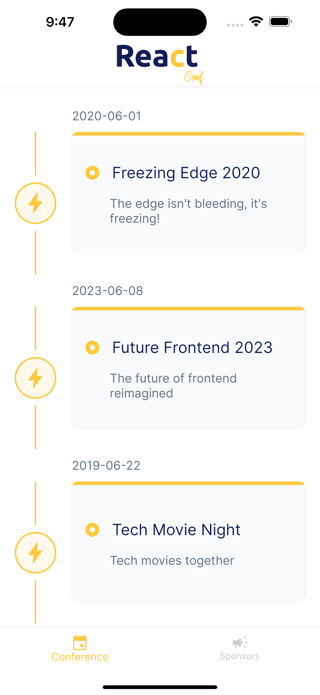
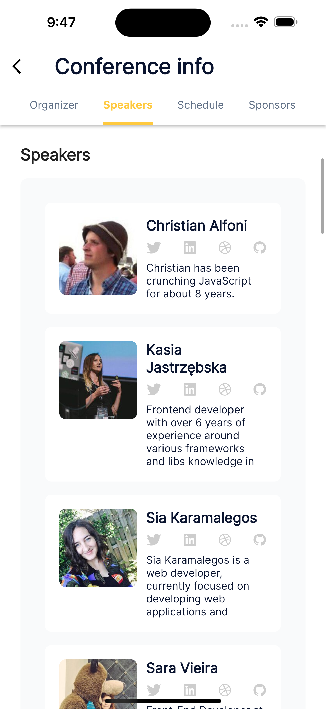
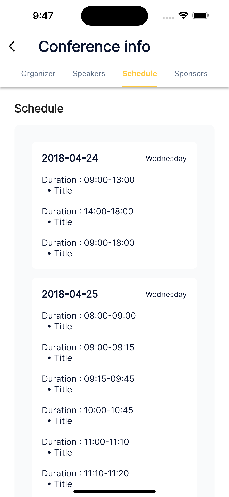
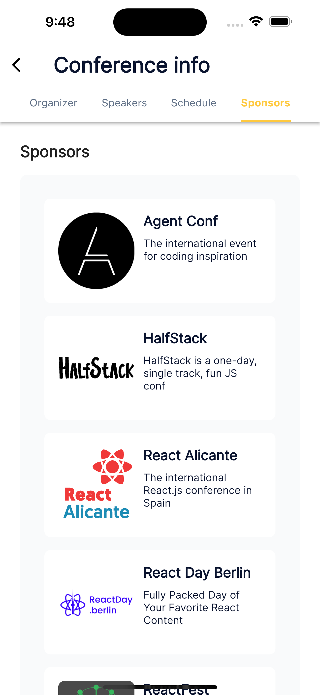
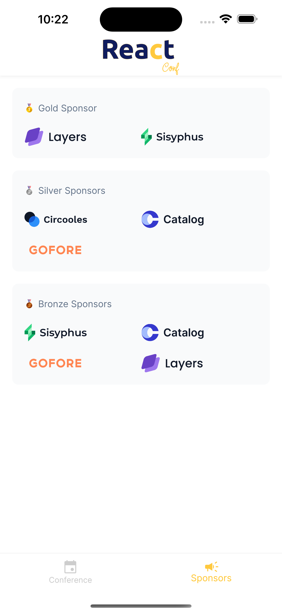

# About

A simple Flutter app that displays Conferences and Conference Details fetched from GraphQl API using Bloc State Management.

#### Installation

In the command terminal, run the following commands:

    $ git clone https://github.com/enamulhaque028/react_conf.git
    $ cd react_conf
    $ flutter run

# Features 🎯

- The 'Home' screen displays a list of conferences fetched from a GraphQL
- Clicking on any conference card on the "Home" screen navigates the user to the "Conference Details" screen
- Implemented state management using Bloc pattern
- Utilized a component-wise design pattern to promote code modularity and reusability
- Fetched conference data using HTTP requests from a GraphQL API using dio package
- Made the app responsive for different screen sizes and orientations

### Download

#### Get it on GitHub

<div>
<a href='https://github.com/enamulhaque028/react_conf/releases/download/publish/react_conf_v1.0.0.apk' target='_blank'></a>
</div>

#### Get it on Google Drive
<div>
<a href='https://drive.google.com/drive/folders/1z8wWQ2vLf_DDTvOBG4jmsvJDrwcpZtAx?usp=sharing' target='_blank'></a>
</div>


## Project Config Roadmap

All the necessary config and dependencies have already been set and ready for use but there is an explanation of each step if you want to know more about the pre-config or customize it.

Initialize the Flutter project, add all the necessary dependencies mentioned above in the **pubspec.yaml** configuration file and run `pub get`.

**pubspec.yaml**
```yaml
dependencies:
  flutter:
    sdk: flutter

  cupertino_icons: ^1.0.2
  flutter_screenutil: ^5.6.0
  flutter_bloc: ^8.1.3
  equatable: ^2.0.3
  get_it: ^7.6.0
  dio: ^5.3.0
  flutter_svg: ^1.1.6
  vertical_scrollable_tabview: ^0.0.9
  scroll_to_index: ^3.0.1

dev_dependencies:
  flutter_test:
    sdk: flutter

  flutter_lints: ^2.0.0
```


#### Screenshots

<table>
    <tr>
        <td></td>
        <td></td>
    </tr>
    <tr>
        <td></td>
        <td></td>
    </tr>
    <tr>
        <td></td>
        <td></td>
    </tr>
</table>